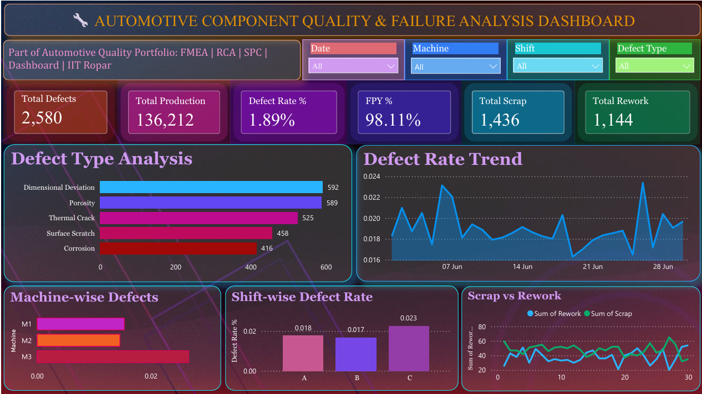

# 🔍 Automotive Failure Mode Monitoring Dashboard

## Overview
A failure mode monitoring dashboard built in Microsoft 
Power BI to track, visualize, and analyze manufacturing 
defects in automotive disc brake rotors. Developed as 
part of a systematic failure analysis study combining 
RCA, FMEA, SPC, and data visualization methodologies.

**Prepared by:** Prapti Borkar
**Institute:** IIT Ropar — B.Tech Metallurgical & 
Materials Engineering
**Goal:** Automotive Failure Analysis Engineering
**Tool:** Microsoft Power BI
**Date:** June 2026

---

## Why This Dashboard Matters For Failure Analysis

In failure analysis, identifying patterns in failure 
data is as important as investigating individual failures.
This dashboard answers:

- Which failure mode occurs most frequently?
- Which machine produces the most failures?
- Is the failure rate increasing or stable over time?
- What is the ratio of repairable vs catastrophic failures?

These are exactly the questions a failure analyst asks 
before initiating a detailed root cause investigation.

---

## Failure Modes Tracked

All 5 defect types are sourced directly from the 
DFMEA study conducted on this component:

| Failure Mode | Count | Failure Mechanism |
|---|---|---|
| Dimensional Deviation | 592 | Tooling wear, thermal expansion |
| Porosity | 589 | Casting solidification defects |
| Thermal Crack | 525 | Heat checking, thermal fatigue |
| Surface Scratch | 458 | Handling, abrasive wear |
| Corrosion | 416 | Electrochemical attack, moisture |

---

## Key Failure Analysis Findings

- Dimensional Deviation and Porosity account for 
  largest share of failures — priority investigation targets
- M3 shows highest failure rate — systematic 
  machine-level cause suspected
- Shift C failure rate (0.023%) significantly higher 
  than Shift A (0.018%) — human factors possible cause
- Failure rate stable between 0.016–0.024% — 
  no catastrophic process drift detected
- Thermal Crack failures connect directly to RCA 
  findings on heat treatment effects in steel components

---

## Dashboard Visuals

| Visual | Failure Analysis Purpose |
|---|---|
| Defect Type Bar Chart | Identify dominant failure modes (Pareto) |
| Defect Rate Trend | Detect failure rate drift over time |
| Machine-wise Chart | Isolate machine-level failure causes |
| Shift-wise Chart | Identify human factor influences |
| Scrap vs Rework | Assess failure severity distribution |

---

## Part of Failure Analysis Portfolio

This dashboard is the data visualization component 
of a complete failure analysis study:

| Study | Methodology | Focus |
|---|---|---|
| Failure Investigation | 8D RCA, Ishikawa, 5-Why | Ford Recall 22V454 — HSLA Steel yield strength degradation |
| Predictive Failure Analysis | DFMEA, RPN, AIAG | Disc brake rotor failure mode identification |
| Statistical Failure Detection | SPC, X-bar R, Cp/Cpk | Process capability and failure threshold monitoring |
| Failure Pattern Visualization | Power BI, DAX | This dashboard — failure mode monitoring |

---

## Skills Demonstrated

**Failure Analysis:**
Root Cause Analysis, FMEA, Failure Mode Identification,
Failure Pattern Recognition, Corrective Action Development

**Materials Engineering:**
HSLA Steel, Grey Cast Iron, Heat Treatment Effects,
Microstructural Analysis, Phase Transformations

**Quality Standards:**
IATF 16949, AIAG FMEA, 8D Methodology

**Technical Tools:**
Microsoft Power BI, DAX, MS Excel, SolidWorks,
Thermo-Calc, GitHub

---

## Target Applications

This portfolio is targeted toward roles in:
- Automotive Failure Analysis Engineering
- Quality Engineering — Failure Investigation
- R&D Materials Engineering
- Testing & Certification (TÜV, Bureau Veritas)
- Defence Metallurgy (DRDO DMRL)

---

## Contact

**Prapti Borkar**
B.Tech Metallurgical & Materials Engineering
Indian Institute of Technology, Ropar
GitHub: github.com/PraptiBorkar
LinkedIn: linkedin.com/in/prapti-borkar-ab5309329
Email: 2024mmb1419@iitrpr.ac.in
